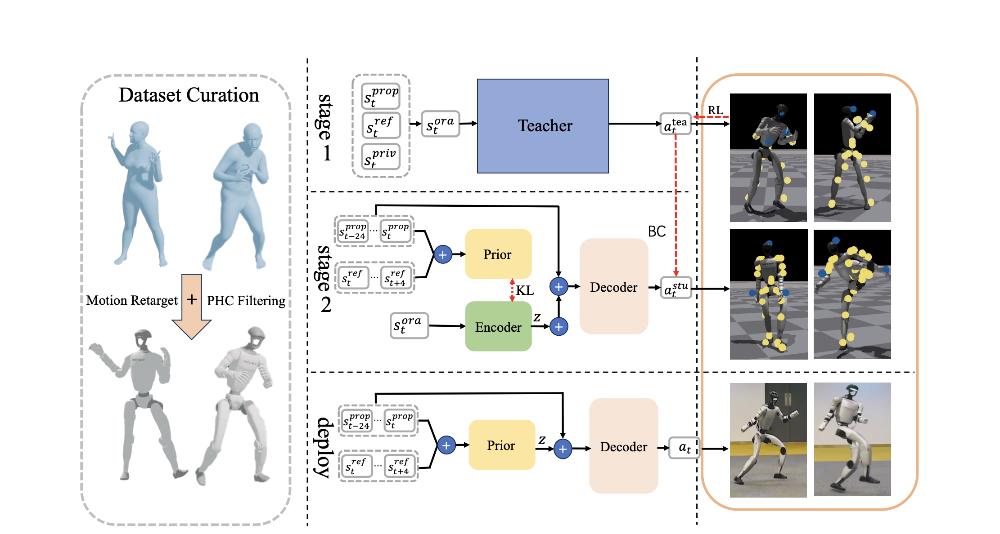
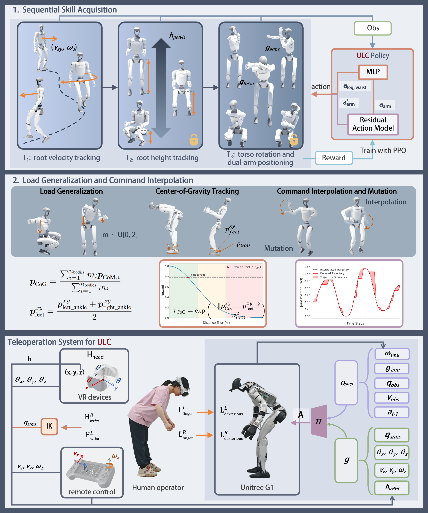
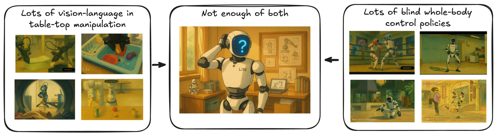
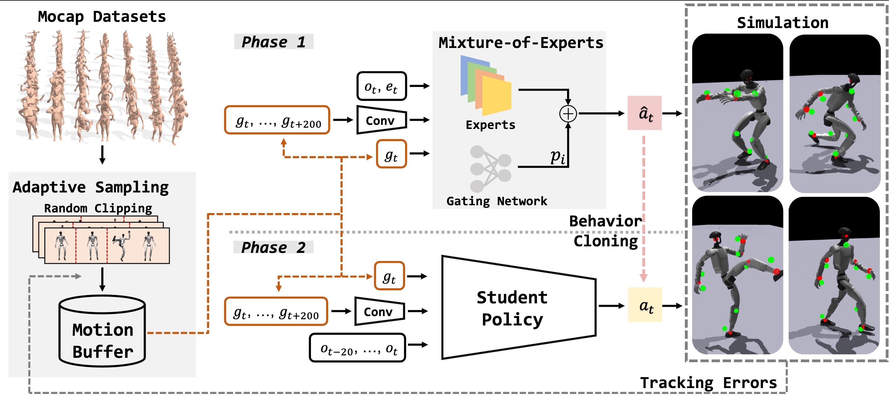
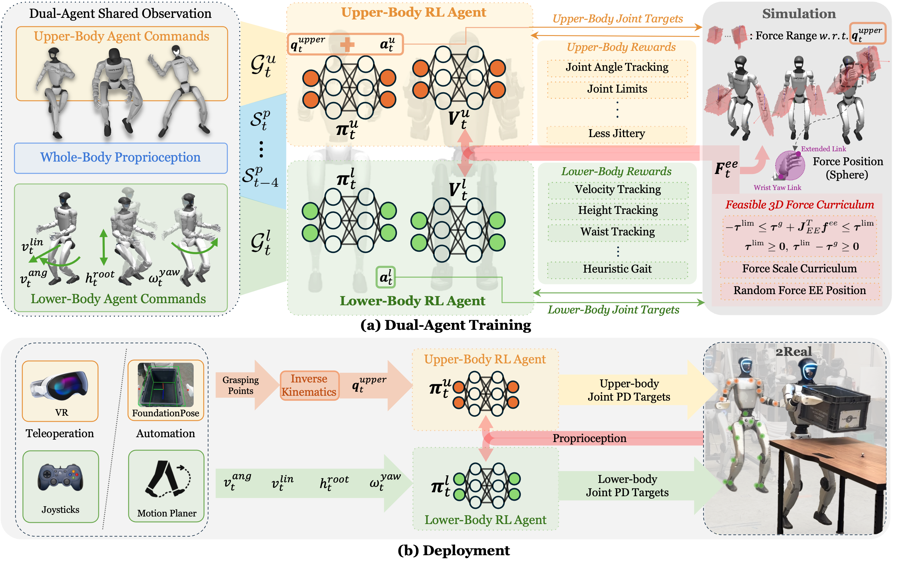
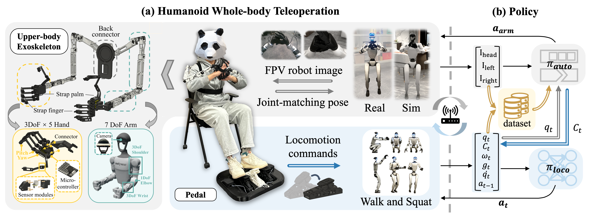
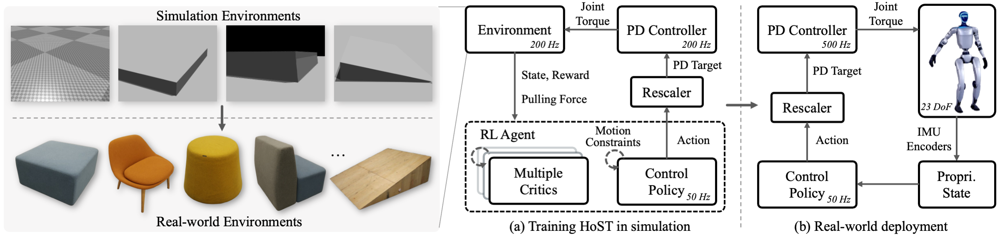

# Awesome-Humanoid-Whole-Body-Control
  

**Foreword**
This compilation provides a rigorously curated survey of state-of-the-art literature, toolkits, and datasets in the domain of humanoid robot learning. It is maintained as a living document and we welcome community-driven enhancements via pull requests. The markdown document primarily includes papers, titles, project websites, code and datasets, abstract summary, algorithmic system frameworks, and the author's affiliation (only displaying the first author's affiliation).

---

## Loco-Manipulation and Whole-Body-Control

|   ArXiv   |   Title   |   Website   |   Code & Dataset    |   Abstract Summary   |   Overview   |   Organization   |
|:---------:|:---------:|:-----------:|:-------------------:|:--------------------:|:------------:|:----------------:|
| [arXiv 2025.07](https://arxiv.org/abs/2507.07356) | UniTracker: Learning Universal Whole-Body Motion Tracker for Humanoid Robots             | [UniTracker](https://yinkangning0124.github.io/Humanoid-UniTracker/) | - | UniTracker提出在师生框架中引入条件变分自编码器（CVAE），以显式建模并保留教师策略的丰富动作多样性，相比仅用 MLP-DAgger 蒸馏的传统方法，单一学生策略即可泛化跟踪更多样、更未见过的全身参考动作，仿真与实物实验显示其在多样运动类型与未知动作上均显著优于现有基线。 |  | Shanghai Jiao Tong University |
| [arXiv 2025.07](https://arxiv.org/abs/2507.06905) | ULC: A Unified and Fine-Grained Controller for Humanoid Loco-Manipulation | [ULC](https://ulc-humanoid.github.io) | Coming Soon| ULC提出统一人形机器人移动-操作控制器 ULC，用单一端到端策略同时跟踪根速度/高度、躯干姿态与双臂关节，通过序列技能递增、残差动作建模、指令多项式插值、随机延迟释放、负载随机化与质心跟踪六大技术实现高精度、大工作空间与鲁棒性，Unitree G1 实测较分层基线显著提升跟踪精度并能在负重扰动下完成复杂全身协调任务。 |  | Harbin Institute of Technology |
| [arXiv 2025.06](https://arxiv.org/abs/2506.12851) | KungfuBot: Physics-Based Humanoid Whole-Body Control for Learning Highly-Dynamic Skills | [KungfuBot](https://kungfu-bot.github.io/) | [🖥️](https://github.com/TeleHuman/PBHC)| KungfuBot提出“多步运动处理+自适应跟踪容忍度的双层优化”框架，用非对称演员-评论家策略在物理约束内高效模仿高动态功夫/舞蹈动作。在运动处理方面，设计了一个流程来提取、过滤、校正和重新定位运动，同时最大程度地确保符合物理约束；在运动模仿方面，构建了一个双层优化问题，根据当前跟踪误差动态调整跟踪精度容差，从而创建了一种自适应课程机制。相较现有方法显著降低跟踪误差并成功部署于Unitree G1，实现稳定且富表现力的全身控制。 |  | 中国电信人工智能研究院(TeleAI) |
| [arXiv 2025.06](https://arxiv.org/abs/2506.13751) | LeVERB: Humanoid Whole-Body Control with Latent Vision-Language Instruction | [LeVERB](https://ember-lab-berkeley.github.io/LeVERB-Website/) | Coming Soon & [🤗](https://huggingface.co/datasets/ember-lab-berkeley/LeVERB-Bench-Dataset) | LeVERB 首次提出“高层视觉-语言策略自训潜在动作词汇 + 底层 RL-WBC 策略解码”的分层框架，打破以往依赖手工低层动作词汇的局限，在首创的 150 项人形全身控制基准中实现 58.5% 零样本成功率，较朴素 VLA 提升 7.8 倍，并支持动态奔跑等敏捷行为。 |  | University of California Berkeley | 
| [arXiv 2025.06](https://arxiv.org/abs/2506.14770) | GMT: General Motion Tracking for Humanoid Whole-Body Control | [GMT](https://gmt-humanoid.github.io/) | [🖥️](https://github.com/zixuan417/humanoid-general-motion-tracking) | 追踪现实世界中一般的全身运动的能力是构建通用人形机器人的有效方法。然而，由于运动在时间和运动学上的多样性、策略的能力以及上下身协调的难度，实现这一点可能具有挑战性。为了解决这些问题，我们提出了GMT，这是一个通用且可扩展的运动追踪框架，可训练单一统一的策略，使人形机器人能够追踪现实世界中的各种运动。GMT 基于两个核心组件构建：自适应采样策略和运动混合专家 (MoE) 架构。自适应采样在训练期间自动平衡简单和困难的动作。MoE 确保更好地专门化运动流形的不同区域。我们通过在模拟和现实世界中的大量实验证明了 GMT 的有效性，使用统一的通用策略在广泛的运动范围内实现了最先进的性能。 |  | UC San Diego | 
| [arXiv 2025.05](https://arxiv.org/abs/2505.06776) | FALCON: Learning Force-Adaptive Humanoid Loco-Manipulation | [FALCON](https://lecar-lab.github.io/falcon-humanoid/) | [🖥️](https://github.com/LeCAR-Lab/FALCON/) | 人形机器人操控技术为日常服务和工业任务带来了革命性的潜力，然而，实现精准、稳健的全身控制并实现与三维末端执行器力的相互作用仍然是一项重大挑战。先前的方法通常仅限于轻量级任务或四足/轮式平台。为了克服这些局限性，我们提出了FALCON，这是一个基于双智能体强化学习的框架，用于实现稳健的力自适应人形机器人操控。FALCON将全身控制分解为两个专门的智能体：(1) 下肢智能体，确保在外力干扰下保持稳定的运动；(2) 上肢智能体，通过隐式自适应力补偿精确跟踪末端执行器的位置。这两个智能体在模拟环境中进行联合训练，使用力课程，在遵守扭矩限制的同时，逐步增加施加在末端执行器上的外力。实验表明，与基线相比，FALCON实现了 2$\times$ 更高精度的上肢关节追踪，同时在力干扰下保持稳健的运动，并实现更快的训练收敛。此外，FALCON无需针对具体实例的奖励或课程调整即可实现策略训练。使用相同的训练设置，我们获得了可部署于多个类人机器人的策略，从而能够在现实世界中执行强力的机械操作任务，例如运输有效载荷（0-20N 力）、拉动推车（0-100N）和开门（0-40N）。 |  | Carnegie Mellon University |
| [arXiv 2025.02](https://arxiv.org/abs/2502.13013) | HOMIE:Humanoid Loco-Manipulation with Isomorphic Exoskeleton Cockpit | [HOMIE](https://homietele.github.io/) | [🖥️](https://github.com/OpenRobotLab/OpenHomie) | 当前的类人遥操作系统要么缺乏可靠的底层控制策略，要么难以获取精确的全身控制命令，这使得类人机器人难以进行远程操控。为了解决这些问题，我们提出了一种新型类人遥操作驾驶舱，它集成了类人操控策略和低成本的外骨骼硬件系统。该策略使类人机器人能够行走和下蹲到特定的高度，同时适应任意的上半身姿势。这是通过我们基于强化学习的新型训练框架实现的，该框架结合了上半身姿势课程、高度跟踪奖励和对称性利用，而不依赖于任何运动先验。作为对策略的补充，该硬件系统集成了同构外骨骼臂、一副运动感应手套和一个踏板，允许单个操作员实现对类人机器人的完全控制。实验表明，与基于逆运动学的方法相比，我们的驾驶舱能够实现更稳定、快速和精确的人形机器人远程操控，加快任务完成速度并消除重新定位误差。我们还验证了驾驶舱收集的数据对于模仿学习的有效性。 |  | Shanghai AI Laboratory | 
| [arXiv 2025.02](https://arxiv.org/abs/2502.08378) | Learning Humanoid Standing-up Control across Diverse Postures | [HoST](https://taohuang13.github.io/humanoid-standingup.github.io/) | [🖥️](https://github.com/OpenRobotLab/HoST) | HoST 通过多评论家架构与地形-姿态课程从 0 学起立，以平滑正则和隐式速度约束抑制硬件振荡，仿真训练后零调参直接部署 Unitree G1，在实验室与户外多样地形、姿态下均实现平滑、稳定、鲁棒起立，填补真实硬件无预设轨迹起立控制空白。 |  | Shanghai AI Laboratory | 